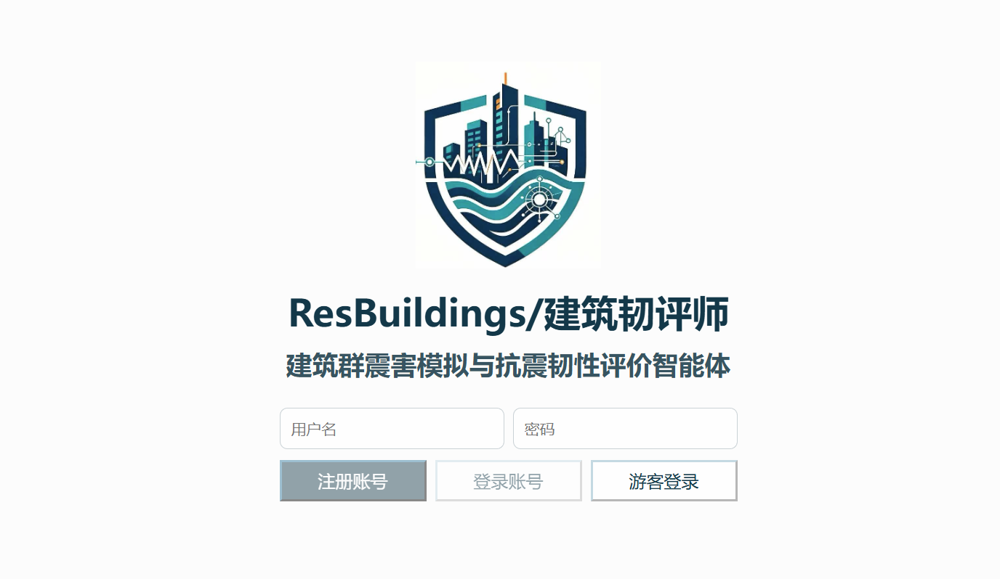
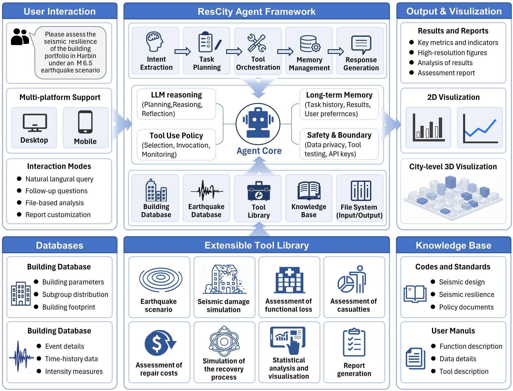
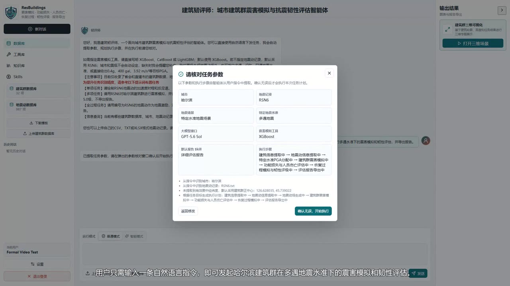
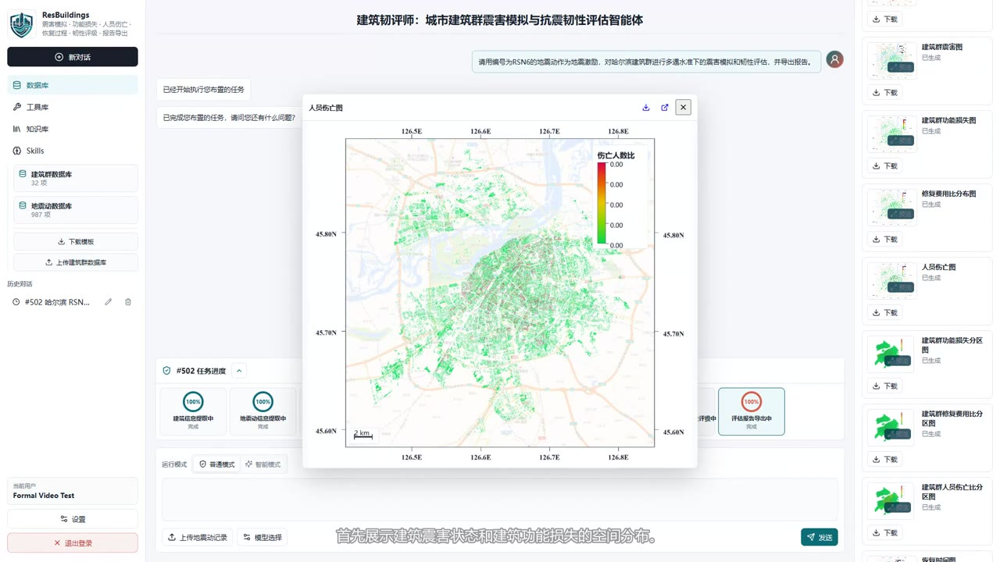
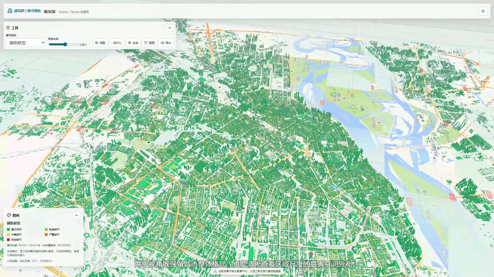
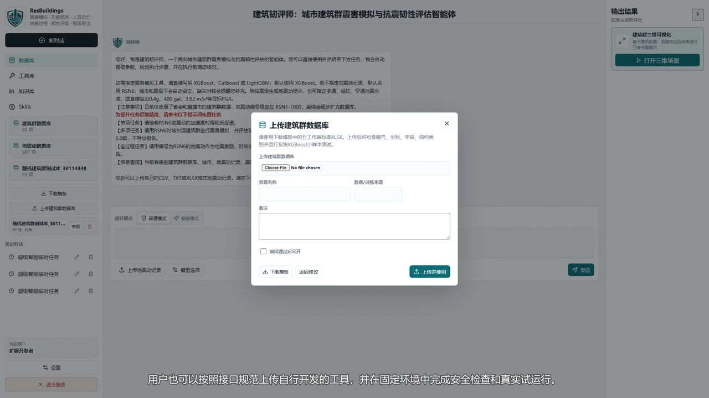
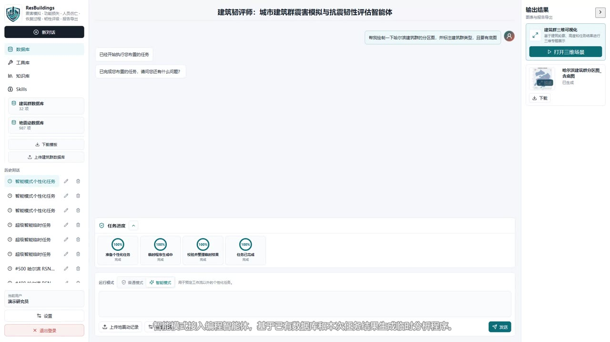

# ResBuildings / 建筑韧评师

  

  <strong>城市建筑群震害模拟与抗震韧性评估智能体</strong> 
  <strong>An AI Agent for Urban Building-Portfolio Seismic Damage Simulation and Resilience Assessment</strong>

  <a href="#在线访问--live-access">在线访问 / Live Access</a> · <a href="#总体框架--architecture">总体框架 / Architecture</a> · <a href="#中文介绍">中文</a> · <a href="#english">English</a> · <a href="#演示视频--demo-videos">演示视频 / Demo Videos</a>

## 在线访问 / Live Access

  <a href="http://rescity-buildings.me:5055/"><strong>访问 ResBuildings 智能体 / Open the ResBuildings Agent</strong></a> 
  <a href="http://rescity-buildings.me:5055/">http://rescity-buildings.me:5055/</a>

## 意见反馈 / Feedback

  <a href="https://ks.wjx.com/vm/YDI8v1R.aspx"><strong>意见反馈 / Feedback</strong></a> 

## 演示视频 / Demo Videos

| 中文演示 / Chinese Demo | English Demo |
|---|---|
| [观看或下载中文演示](content/videos/ResBuildings_Chinese_Demo_GitHub.mp4) | [Watch or download the English demo](content/videos/ResBuildings_English_Demo_GitHub.mp4) |

## 总体框架 / Architecture

图中概括了自然语言交互、意图提取、任务规划、工具编排、长期记忆、安全边界、可信数据库、可扩展工具库、知识库及结果可视化之间的关系。  
The framework connects natural-language interaction, intent extraction, task planning, tool orchestration, long-term memory, safety boundaries, trusted databases, an extensible tool library, engineering knowledge, and output visualization.

## 中文介绍

### 项目简介

ResBuildings 是面向城市建筑群的地震工程智能体。用户可以用自然语言描述任务，智能体负责识别意图、补全与确认参数、规划工程流程、调用经过验证的数据与计算工具，并将实际输出整理为地图、统计图表、三维场景和图形化报告。

系统坚持“语言模型负责推理与编排，工程工具负责数值计算”的设计原则。震害、损失、恢复和韧性结论来自可追踪的数据库、模型、工具及输出文件，而不是由语言模型直接生成数值。

### 核心功能

- **自然语言任务规划**：识别震害模拟、完整韧性评估、结果分析、知识咨询和报告生成等任务，提取城市、地震动、震级、震中、模型和报告要求，并在执行前集中确认。
- **城市尺度震害模拟**：基于标准化建筑群数据库、地震动记录和 XGBoost、CatBoost、LightGBM 等模型，计算建筑损伤状态及其空间分布。
- **后果与韧性评估**：支持建筑功能损失、人员伤亡、修复相关损失、恢复过程和抗震韧性指标的连续分析。
- **基于真实输出的追问分析**：读取任务生成的 CSV、XLSX、JSON、图件和报告，完成统计、比较、解释与追问，避免脱离结果文件作答。
- **研究级可视化与报告**：生成二维专题地图、统计图表、城市建筑群三维场景及图形化 PDF 报告，便于检查、交流和复用。
- **工程知识检索**：从导则、规范、手册、数据库说明和工具文档中检索文本、表格、图件及页码证据，为知识型问题提供依据。
- **可扩展资源体系**：用户可上传符合接口规范的建筑数据、震害模型和自定义工具；系统执行格式校验、能力检查和隔离运行。
- **任务记忆与连续交互**：记录任务意图、参数、流程、输出和历史会话，使后续追问能够延续既有工程上下文。

### 功能展示

| 自然语言规划与参数确认 | 二维结果与输出追踪 |
|---|---|
|  |  |

| 城市建筑群三维展示 | 用户资源扩展 |
|---|---|
|  |  |

| 智能模式 |
|---|
|  |

### 主要贡献

1. **将大语言模型定位为工程流程编排器，而非数值计算器。** 语言模型负责意图理解、任务分解、工具选择和结果解释，数值结论由可信工程工具产生。
2. **贯通“地震情景—震害—后果—恢复—韧性—可视化—报告”的端到端链路。** 用户无需手工切换多个独立程序，即可完成可执行、可追踪的连续工作流。
3. **结果驱动的智能分析。** 智能体直接读取本次任务的实际输出文件，以确定性统计和文件证据支持自然语言追问。
4. **知识与计算双重约束。** RAG 为规范咨询提供可定位证据，工程数据库与工具约束数值计算，共同降低幻觉和能力虚构。
5. **标准工具与隔离智能模式协同。** 稳定任务优先复用验证过的标准工具，开放性任务可在受控目录中生成临时分析程序，兼顾可靠性与灵活性。
6. **用户资源可扩展但先验证。** 建筑数据、模型和自定义工具进入工作流前先完成结构、接口和运行检查，扩展能力不绕过工程约束。
7. **真实城市尺度二维与三维表达。** 将建筑属性、真实轮廓、高度、底图与震害指标关联，既保留城市整体格局，也支持区级空间观察。

## English

### Overview

ResBuildings is an earthquake-engineering agent for urban building portfolios. A user describes a task in natural language; the agent interprets the intent, completes and confirms parameters, plans an engineering workflow, invokes verified data and computational tools, and organizes the actual outputs into maps, charts, 3D scenes, and graphical reports.

Its central design principle is that the language model reasons and orchestrates, while engineering tools perform numerical computation. Damage, loss, recovery, and resilience results are grounded in traceable databases, models, tools, and output files rather than numbers invented directly by the language model.

### Core Capabilities

- **Natural-language task planning:** identifies damage simulation, full resilience assessment, result analysis, knowledge consultation, and report-generation requests; extracts the city, ground motion, magnitude, epicenter, model, and reporting requirements; and confirms them before execution.
- **City-scale seismic damage simulation:** combines standardized building portfolios, ground-motion records, and models such as XGBoost, CatBoost, and LightGBM to estimate damage states and spatial distributions.
- **Consequence and resilience assessment:** supports connected analyses of functional loss, casualties, repair-related loss, recovery, and seismic resilience indicators.
- **Output-grounded follow-up analysis:** reads generated CSV, XLSX, JSON, figures, and reports for statistics, comparisons, explanations, and follow-up questions.
- **Research-grade visualization and reporting:** produces 2D thematic maps, statistical graphics, city-scale 3D building scenes, and graphical PDF reports.
- **Engineering knowledge retrieval:** retrieves evidence from guidelines, specifications, manuals, database documentation, and tool documentation, including text, tables, figures, and page references.
- **Extensible resources:** accepts interface-compliant building datasets, damage models, and custom tools, subject to structural validation, capability checks, and isolated execution.
- **Task memory and continuous interaction:** preserves task intent, parameters, workflows, outputs, and conversation history so later questions can continue from existing engineering context.

### Key Contributions

1. **The LLM acts as an engineering workflow orchestrator, not a numerical calculator.** It handles intent, decomposition, tool selection, and explanation while trusted tools produce numerical results.
2. **An end-to-end earthquake-to-report workflow.** Scenario definition, damage, consequences, recovery, resilience, visualization, and reporting are connected in one traceable process.
3. **Output-grounded intelligent analysis.** Follow-up answers are based on the current task's real files and deterministic statistics rather than detached conversational guesses.
4. **Dual grounding through knowledge and computation.** Retrieval provides locatable evidence for engineering consultation, while trusted databases and tools constrain numerical work.
5. **Verified standard tools plus an isolated intelligent mode.** Stable tasks reuse established tools; open-ended analyses can generate temporary programs within controlled directories.
6. **Validated user extensibility.** Uploaded datasets, models, and tools must pass schema, interface, and execution checks before entering a workflow.
7. **Real city-scale 2D and 3D representation.** Building attributes, footprints, heights, basemaps, and seismic indicators are connected to preserve the overall urban pattern while supporting district-level inspection.

---

The current prototype demonstrates a local engineering workflow with controlled remote access. Production-grade cloud identity, permissions, synchronization, HTTPS, and operational governance remain deployment work rather than claimed research results.
